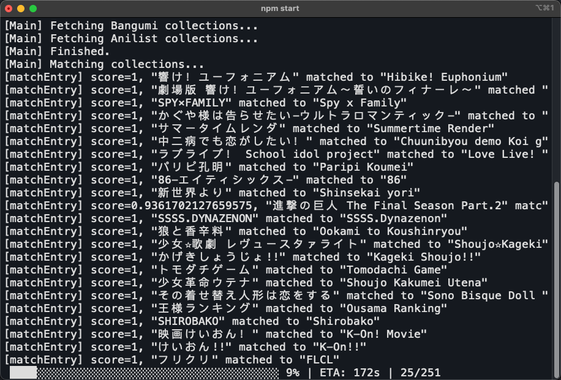

# Bangumi-Sync

> 中文 | [English](README_EN.md)

**一个自动同步所有 Bangumi 动画收视记录到 Anilist 的脚本.**

## 安装

本项目依赖于 [Node.js](https://nodejs.org) 环境。 在终端中运行以下命令下载项目并安装依赖：

```bash
git clone https://github.com/ykozxy/bangumi-sync
cd bangumi-sync
npm i
```

## 运行



首次运行时会先从提供的数据源下载动画数据库，由于数据库文件较大，可能需要一段时间。然后，脚本会自动在浏览器中打开 Bangumi 和 Anilist 的授权界面，按提示操作即可。

### 单次同步模式

单次执行模式中脚本仅会执行单次同步并结束。配置文件内中的 `manual_confirm` 项可用于设置是否在同步更新前手动确认。在终端中执行以下命令来以单次执行模式运行脚本：

```bash
npm start
```

额外的命令行参数：

* `--backward` - 从 Anilist 同步更新回 Bangumi。
* `--both` - 比较两个平台的更新时间，将较新的条目同步到另一端。

### Docker 模式

使用如下命令来构建容器并运行：

```shell
docker build -t bangumi-sync .
docker run -d \
	--name="bangumi-sync" \
	-v $(pwd):/app \
	--restart=unless-stopped bangumi-sync
```

使用 Docker 运行时，`manual_confirm` 变量会被自动忽略，脚本会以配置文件中的 `server_mode_interval` 项设置的时间间隔（秒）为周期同步，所有的输出会写入以脚本启动时间命名的 log 文件。

在第一次运行前，需要先执行以下命令来获取两个平台的 token：

```shell
npm run token
```

在 Docker 运行时发生 token 过期或缺失的问题时，也可使用如上命令来刷新 token。

## 配置

配置文件为 `config/config.json`，其中可配置内容为：

| 变量                          | 描述                                             | 可选参数                               |
|-----------------------------|------------------------------------------------|------------------------------------|
| `sync_comments`             | 是否同步评论                                         | `true` / `false`                   |
| `manual_confirm`            | 是否在上传更新前手动确认，`server` 模式中自动关闭                  | `true` / `false`                   |
| `server_mode_interval`      | 控制 `server` 模式中两次同步的时间间隔（秒）                    | `number`                           |
| `enable_notifications`      | *是否在 `server` 模式中开启桌面通知（仅失败时）(不再使用)*           | `true` / `false`                   |
| `cache_path`                | 缓存路径                                           | 相对路径                               |
| `log_path`                  | 日志文件路径                                         | 相对路径                               |
| `log_file_level`            | 日志文件最低输出级别                                     | `debug` / `info`/ `warn` / `error` |
| `log_console_level`         | 控制台最低输出级别                                      | `debug` / `info`/ `warn` / `error` |
| `global_anime_database_url` | Global 动画数据库地址，如果原地址访问过慢可尝试更改（但务必保证数据库文件格式一致）。 | url                                |
| `china_anime_database_url`  | China 动画数据库地址，默认使用 `jsdelivr` 加速。              | url                                |

## 手动条目匹配

因为本项目未能做到 100% 的自动匹配，所以可以通过编辑 `config/manual_relations.json` 来手动添加条目匹配或编辑 `config/ignore_entries.json` 来忽略某些条目。

`manual_relation.json` 中的每一项应为 `[bangumi_id, anilist_id]` 的形式，代表强制将这两个条目进行匹配。

`ignore_entries.json` 中的每一项应为对应平台的 ID，遇到与这些 ID 相同的条目时将会忽略它们。

## 条目匹配原理

由于我能找到的所有国内动画数据库均与外网基于 MAL/anidb
的数据库条目信息有出入，所以简单进行条目名称匹配受到限制。因此，本项目的匹配方式采用了将每一个条目进行名称模糊匹配+信息精确匹配的方式。由于每一次匹配需要进行大量模糊查询，这种方式一定程度上牺牲了效率来换取较高的精度。

经测试，本人 bangumi 收藏中的 250+ 个动画条目仅有 22 个匹配失败。去除欧美动画以及 bangumi 本身信息缺失的条目，仅有 9 个因为数据库信息不匹配而导致失败。总成功率约为 95%。

匹配的具体实现方式在 [data_util.ts](src/utils/data_util.ts) 中。

## 已知限制

- 由于使用的 [anime-offline-database](https://github.com/manami-project/anime-offline-database) 数据库大小 (33mb) 超出了 jsdelivr
  的文件大小限制，所以默认使用 github 源。因此国内用户可能会访问受限，体现于在初次加载脚本时的时间较长。
- 因为 Anilist API 的访问频率限制为 90 requests/min，所以在单次同步条目过多时会触发流量限制并用时较长。
- 目前使用的条目匹配算法需要对 30000+ 条 global 数据库条目进行逐一比对，所以首次匹配时间可能会较长。之后运行时由于会记录缓存所以速度会变快。

## TODO

- [x] Server 模式 (使用 Docker)。
- [x] Server 模式中的通知推送（在 Docker 中暂时无法使用）。
- [x] 从 Anilist 到 bangumi 的双向同步。
- [ ] 使用 postgres/mongoDB 等数据库作为后端储存。

## 数据来源

- Global 动画数据：[manami-project/anime-offline-database](https://github.com/manami-project/anime-offline-database)
- 国内动画数据：[bangumi-data](https://github.com/bangumi-data/bangumi-data)
